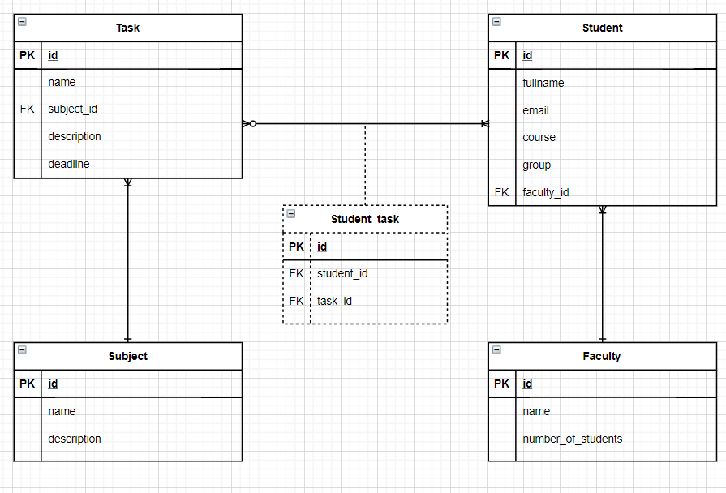
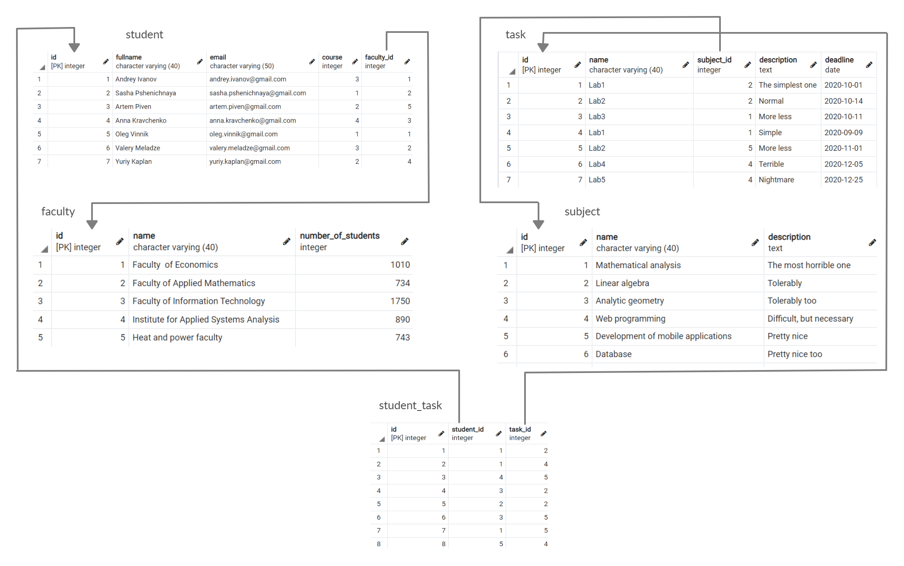

# Лабораторна робота No 1.
## Проектування бази даних та ознайомлення з базовими операціями СУБД PostgreSQL
### Концептуальна модель учбової предметної області «Університет»

### Опис структури БД «Університет»

Сутність | Опис сутності | Атрибут | Тип
------------ | ------------- | ------------- | -------------
Student | Містить інформацію про студента | id – унікальний ID студента в БД; fullname – прізвище та ім’я студента; email – електронна пошта студента; course – номер курсу студента; faculty_id – ID факультету студента | Числовий; Текстовий(40); Текстовий(50); Числовий; Числовий
Faculty | Містить інформацію про факультет | id – унікальний ID факультету в БД; name – назва факультету; number_of_students – кількість студентів на факультеті | Числовий; Текстовий(40); Числовий
Subject | Містить інформацію про предмет(дисципліну)| id – унікальний ID предмету в БД; name – назва предмету; description – опис предмету | Числовий; Текстовий(40); Текст
Task | Містить інформацію про завдання з предмету | id – унікальний ID завдання в БД; name – назва завдання; subject_id – ID предмету, з якого задано завдання; description – опис завдання; deadline – дедлайн завдання | Числовий; Текстовий(40); Числовий; Текст; Дата
Student_task | Містить інформацію про розподіл завдань серед студентів | id – унікальний ID пари «студент-завдання»; student_id – ID студента; task_id – ID завдання |  Числовий; Числовий; Числовий

### Структура БД «Університет»

