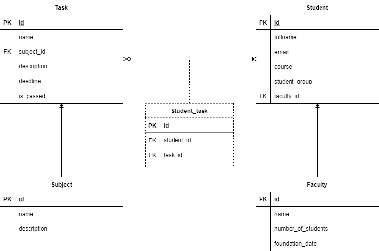

# Лабораторна робота No 2.
## Створення додатку бази даних, орієнтованого на взаємодію з СУБД PostgreSQL
### Концептуальна модель учбової предметної області «Університет»

### Опис структури БД «Університет»
Сутність | Опис сутності | Атрибут | Тип
------------ | ------------- | ------------- | -------------
Student | Містить інформацію про студента | id – унікальний ID студента в БД; fullname – прізвище та ім’я студента; email – електронна пошта студента; course – номер курсу студента; student_group - навчальна група студента; faculty_id – ID факультету студента | Числовий; Текстовий(40); Текстовий(50); Числовий; Текстовий(10); Числовий
Faculty | Містить інформацію про факультет | id – унікальний ID факультету в БД; name – назва факультету; number_of_students – кількість студентів на факультеті; foundation_date - дата заснування факультету; | Числовий; Текстовий(40); Числовий; Дата
Subject | Містить інформацію про предмет(дисципліну)| id – унікальний ID предмету в БД; name – назва предмету; description – опис предмету | Числовий; Текстовий(40); Текст
Task | Містить інформацію про завдання з предмету | id – унікальний ID завдання в БД; name – назва завдання; subject_id – ID предмету, з якого задано завдання; description – опис завдання; deadline – дедлайн завдання; is_passed - чи здано дане завдання | Числовий; Текстовий(40); Числовий; Текст; Дата; Логічний
Student_task | Містить інформацію про розподіл завдань серед студентів | id – унікальний ID пари «студент-завдання»; student_id – ID студента; task_id – ID завдання |  Числовий; Числовий; Числовий
